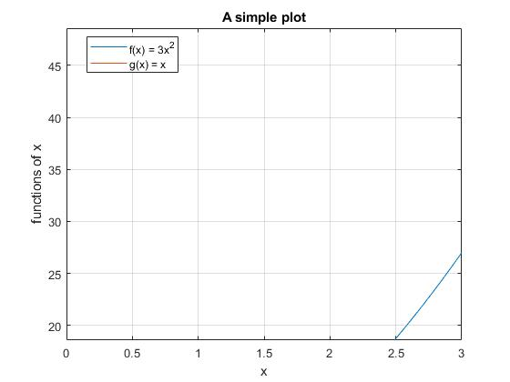

# **Lesson 4: MATLAB Basics**

This lesson focuses on basic MATLAB functionality. 

### **Uses of MATLAB**
  * Calculator
  * Scripts
  * Built in Plotting
  * Built in Functions
  * User defined functions
  * Publication tool
  * Loops
  
### **Introductory Activities**
* MATLAB installation- activate a code through [Mathworks](https://www.mathworks.com/academia.html), some institutions have access 
* If you can get access, download and install. If not, once you purchase an access code or activate one through an institution, you can use [MATLAB online](https://matlab.mathworks.com/)  
* [MATLAB Coding Best Practices](https://www.youtube.com/watch?v=ThDNl4m7GsI&feature=emb_title&ab_channel=AshleeN.FordVersypt)

[](http://www.youtube.com/watch?v=ThDNl4m7GsI "")

#### **Comprehension Check**
* Were any of the best practices new to you?
* Did any surprise you?
* Did any confuse you?
* Describe a situation where you have successfully adopted one of the best practices.
* Describe a situation where you wish in retrospect that you had adopted one of the best practices, but you didn't at the time.     Which best practice was it? Why might it have made a difference to you?

### **Walkthrough and Tutorial**
Walk through coding of the following examples to show how to debug and the uses.
* [Raw File](/CHEclassFa20/In%20Class%20Problem%20Activities/MATLAB/MATLABBasicsStart.m)
* Calculator- do some basic calculations
```MATLAB
2+2
3*4
```
* Scripts
```MATLAB

%% calculate function values
f = 3*x.^2;
g=x;
```
* Built in plotting
```MATLAB
%% MATLABBasicsStart.m
%   make a very simple plot of one function.

%% set parameters
xmin=0;
xmax=3;
Nx=200;

%% set independent variable
x=linspace(xmin,xmax,Nx);

%% calculate function values
f = 3*x.^2;

%% plot results
plot(x,f)
xlabel('x')
ylabel('functions of x')
legend('f(x) = 3x^2','Location','Best');
title('A simple plot')
grid on
```

* Built in functions
```MATLAB
 xmin = 0; 
 xmax = 3;
 Nx = 200;
x=linspace(xmin,xmax,Nx);
* User Defined functions
```MATLAB
%% set parameters
xmin=0;
xmax=3;
Nx=200;

%% set independent variable
x=linspace(xmin,xmax,Nx);

%% calculate function values
f = 3*x.^2;
```
* Publication tool for exporting figures
```MATLAB
%% calculate function values
f = 3*x.^2;
g=x;
%% plot results
plot(x,f)
hold on
plot(x,g)
hold off
xlabel('x')
ylabel('functions of x')
legend('f(x) = 3x^2','g(x) = x','Location','Best');
title('A simple plot')
grid on
end
saveas(MATLABbasics.jpg)
```

* Loops
```MATLAB
function MATLABBasics(varargin)

if nargin < 1
    xmin=0;
else 
    xmin = varargin{1};
end

if nargin < 2
    xmax=3; 
else 
    xmax = varargin{2};
end

if nargin < 3
    Nx=200;
else 
    Nx = varargin{3};
end
``` 
  
### **Additional Resources**
* [Mathworks Website](https://www.mathworks.com/help/matlab/)
* [MATLAB Central](https://www.mathworks.com/matlabcentral/)
* [Video Tutorials for MATLAB GUI Tools](http://learningmatlab.com/videos/index.html)

### **Previous Lesson**
 * [L03 Advanced LaTeX Topics](/L03%20Advanced%20LaTeX%20Topics.md)
### **Next Lesson**
 * [L05 MATLAB Basics Continued](/L05%20MATLAB%20Basics%20Cont.md)
