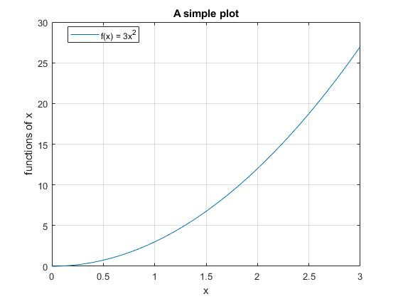
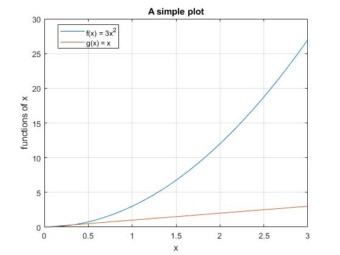

# **Lesson 4: MATLAB Basics**

This lesson focuses on best practices in scientific computing and basic MATLAB functionality. 

## **Related Readings**
[Reading 2](https://github.com/ashleefv/ApplNumComp/blob/master/RecommendedReading.md#reading-2)

 
## **Instructional Video**
* [Coding best practices](https://www.youtube.com/watch?v=ThDNl4m7GsI&feature=emb_title&ab_channel=AshleeN.FordVersypt)

[](http://www.youtube.com/watch?v=ThDNl4m7GsI "Coding best practices")
* Example project shown in the video: https://github.com/ashleefv/BeeNestABM

## **Reflection Questions**
* Were any of the best practices new to you?
* Did any surprise you?
* Did any confuse you?
* Describe a situation where you have successfully adopted one of the best practices.
* Describe a situation where you wish in retrospect that you had adopted one of the best practices, but you didn't at the time. Which best practice was it? Why might it have made a difference to you?

## **Set Up MATLAB Software**
* MATLAB installation: activate a code through [Mathworks](https://www.mathworks.com/academia.html) if your institutions have access. You may also consult your institution to determine if a MATLAB license is available to you. 
* If you can get access, download and install. If not, once you purchase an access code or activate one through an institution, you can use [MATLAB online](https://matlab.mathworks.com/)
* [Octave](https://www.gnu.org/software/octave/index) is an open access software program largely compatible with MATLAB. This can be considered as an alternative if you do not have a MATLAB license.

## **Uses of MATLAB**
  * Calculator
  * Scripts
  * Built in plotting
  * Built in functions
  * User defined functions
  * Publish tool
  * Flow control via loops
  * [Why MATLAB?](https://www.mathworks.com/products/matlab/why-matlab.html)

## **Activity**
Walk through coding of the following examples.
* [Starting file](/CHEclassFa20/In%20Class%20Problem%20Activities/MATLAB/MATLABBasicsStart.m)
* Basic calculations
```MATLAB
2+2
3*4
```
* Scripts
```MATLAB
% MATLABBasicsStart.m
%% calculate function values
f = 3*x.^2;
g=x;
```
* Built in plotting
```MATLAB
%% MATLABBasicsStart.m
%   make a very simple plot of one function.

%% set parameters
xmin=0;
xmax=3;
Nx=200;

%% set independent variable
x=linspace(xmin,xmax,Nx);

%% calculate function values
f = 3*x.^2;

%% plot results
plot(x,f)
xlabel('x')
ylabel('functions of x')
legend('f(x) = 3x^2','Location','Best');
title('A simple plot')
grid on
```


* Built-in functions
```MATLAB
xmin = 0; 
xmax = 3;
Nx = 200;
x = linspace(xmin,xmax,Nx);
```
* User-defined functions
```MATLAB
%% set parameters
xmin=0;
xmax=3;
Nx=200;

%% set independent variable
x=linspace(xmin,xmax,Nx);

%% calculate function values
f = 3*x.^2;
```
* Publish tool for sharing the output from running MATLAB files
```MATLAB
%% calculate function values
f = 3*x.^2;
g=x;
%% plot results
plot(x,f)
hold on
plot(x,g)
hold off
xlabel('x')
ylabel('functions of x')
legend('f(x) = 3x^2','g(x) = x','Location','Best');
title('A simple plot')
grid on
end
saveas(MATLABbasics.jpg)
```

* Loops
```MATLAB
function MATLABBasics(varargin)

if nargin < 1
    xmin=0;
else 
    xmin = varargin{1};
end

if nargin < 2
    xmax=3; 
else 
    xmax = varargin{2};
end

if nargin < 3
    Nx=200;
else 
    Nx = varargin{3};
end
``` 
* [Solution file](/CHEclassFa20/In%20Class%20Problem%20Solutions/MATLAB/MATLABBasics.m) or [solution MATLAB live script](https://github.com/ashleefv/ApplNumComp/blob/master/CHEclassFa20/In%20Class%20Problem%20Solutions/MATLAB/MATLABBasics.mlx) and publish output [pdf file](https://github.com/ashleefv/ApplNumComp/blob/master/CHEclassFa20/In%20Class%20Problem%20Solutions/MATLAB/MATLABBasicsSoln.pdf)

## **References for Further Exploration**
* [Mathworks website](https://www.mathworks.com/help/matlab/)
* [MATLAB Central](https://www.mathworks.com/matlabcentral/)
* [Video tutorials based on Learning to Program with MATLAB: Building GUI Tools by Craig S. Lent](http://learningmatlab.com/videos/index.html)
* [Additional MATLAB reference books](https://github.com/ashleefv/ApplNumComp/blob/master/RecommendedReading.md#matlab-reference-books)

## **Previous Lesson**
 * [L03 Advanced LaTeX Topics](/L03%20Advanced%20LaTeX%20Topics.md)
## **Next Lesson**
 * [L05 MATLAB Basics Continued](/L05%20MATLAB%20Basics%20Cont.md)
