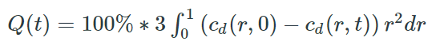

# **Lesson 7: MATLAB Functions**

This lesson introduces built-in MATLAB functions for common classes of numerical methods for solving nonlinear equations, numerical integration, and ordinary differential equations (initial value problems).

## **Related Readings**
[Reading 4](https://github.com/ashleefv/ApplNumComp/blob/master/RecommendedReading.md#reading-4)

## **Instructional Videos**
* [Numerical methods](https://www.youtube.com/watch?v=430j9WP1uTQ&feature=emb_title&ab_channel=AshleeN.FordVersypt)
 
[](http://www.youtube.com/watch?v=430j9WP1uTQ "")
* [Using MATLAB to solve a system of linear equations](https://www.youtube.com/watch?v=C4Ineu8uqGg&feature=emb_title&ab_channel=AshleeN.FordVersypt)
  
[](http://www.youtube.com/watch?v=C4Ineu8uqGg "")
* [MATLAB solvers](https://www.youtube.com/watch?v=8g_LB9J0RAQ&feature=emb_title&ab_channel=LearnChemE)
  
[](http://www.youtube.com/watch?v=8g_LB9J0RAQ "")

## **Reflection**
* Find the MATLAB documentation for one of the built-in functions shown in the videos.

## **Optimization Functions**
* https://www.mathworks.com/help/matlab/optimization.html
* Solving nonlinear equations
    * fzero
    * fsolve
* Non-linear data-fitting
    * lsqcurvefit
* General optimization (minimization)
    * fminbnd
    * fmincon
* Example 1 code snippet
```MATLAB
OPTIONS = optimoptions(@lsqcurvefit, 'Algorithm', 'trust-region-reflective', 'TolX', 1e-6, 'TolFun', 1e-6, 'StepTolerance', 1e-13, 'MaxFunEvals', 1000, 'MaxIter', 3000);
[coefficients, resnorm] = lsqcurvefit(@(coefficients,Xdata) myModel(coefficients, Xdata, ModelParameters), coefficientsGuess, Xdata, Ydata, LB, UB, OPTIONS)
```

## **Numerical Integration Functions**
* https://www.mathworks.com/help/matlab/numerical-integration-and-differentiation.html
    * quad, quadl, quadv --> integral
    * trapz
* Example 2 code snippet
```MATLAB
function quad_example    
   for tt=2:numberTimePoints
   % functions and NR for the polynomial    
   % order in polyfits    
   numeratorY=(cdrugt0(1:NR)-cdrug(1:NR,tt))'...        
   .*radius(1:NR).*radius(1:NR);    
   % fit numerator integrand with 10th order polynominal    
   numerator_coef=polyfit(radius,numeratorY,10);    
   cumulrel_num(tt)=quad(@(r) CRIN(numerator_coef,r),0,1,TOL);    
   end
end

function cumulrel_integrandnum = CRIN(numerator_coef,r)    
   cumulrel_integrandnum = polyval(numerator_coef,r)
end
```

* Example 3 code snippet to determine the cumulative amount over time of a chemical leaking from a sphere under certain conditions is


```MATLAB
for t=2:numberTimePoints    
    Q(t) = 100*(3*dr*trapz((cd0(1:NR) - cd(1:NR,t))'.*radius(1:NR) .*radius(1:NR)));
end   
```

## **ODE Solvers**
Solving ordinary differential equations:
* http://www.mathworks.com/help/matlab/ordinary-differential-equations.html
* http://www.mathworks.com/help/matlab/math/choose-an-ode-solver.html
* http://www.mathworks.com/help/matlab/math/summary-of-ode-options.html
* Example 4
```MATLAB
%% call the ODE solver
% initial condition for the ODE solver
conc_t0 = [AngI_conc_t0; AngII_conc_t0; Renin_conc_t0]; %% CE AngI Value
% ODE solver options
options = odeset('RelTol',1e-12,'AbsTOL',1e-6);
[t,conc] = ode45(@(t,conc) ODE(t,conc,params),time,conc_t0,options);

AngI_conc = conc(:,1).*Mw_AngI*1000/10^6; % pg/ml   %% CE AngI Value
AngII_conc = conc(:,2).*Mw_AngII*1000/10^6; % pg/ml
Renin_conc = conc(:,3).*Mw_Renin*1000/10^6; % pg/ml

%% Local function: ODE
% Define the differential equations for concentrations of non-drug species
function d_conc_dt = ODE(t,conc,params)  %% CE AngI Value
    
    % Input concentration vector conc contains species AngI, AngII & Renin
    AngI_conc = conc(1); % angiotension I concentration nmol/ml  %% CE AngI Value
    AngII_conc = conc(2); % angiotension II concentration nmol/ml
    Renin_conc = conc(3); % renin concentration nmol/ml
    %%%%%%%%%%%%
    % PD model
    %%%%%%%%%%%%
    % Rxn 1
    % Production rate of Ang I from angiotensinogen --> Ang I in presence
    % of Renin with baseline and variable contributions. Only Renin changes 
    % due to drug presence.
    variable_prod_AngI = k_cat_Renin*(Renin_conc-Renin_conc_t0);  %% CE AngI Value
    r1 = variable_prod_AngI+baseline_prod_AngI; %% CE AngI Value
    %%%%%%%%%%%%
    % Rxn 2
    % Baseline production of Renin + feedback from AngII to Renin 
    % production
    r2 = baseline_prod_Renin + k_feedback*(AngII_conc_t0-AngII_conc)
    %%%%%%%%%%%%
    % Rxn 3
    % Degradation of Renin
    r3 = k_degr_Renin*Renin_conc;
    %%%%%%%%%%%%
    % Rxn 4
    % Degradation of Ang I
    r4 = k_degr_AngI*AngI_conc;     %% CE AngI Value
    %%%%%%%%%%%%
    % Rxn 5
    % Rate of Ang I --> Ang II catalyzed by ACE with AngI_conc and I/KI 
    % changing due to drug presence
    r5 = VmaxoverKm*AngI_conc*(1-Inhibition);  %% CE AngI Value
    %%%%%%%%%%%%
    % Rxn 6
    % Consumption rate of Ang II --> with AngII_conc being the only term 
    % thatchanges due to drug presence
    r6 = k_cons_AngII*(AngII_conc - AngII_conc_t0) + baseline_cons_AngII;
    
    % ODEs for the three changing hormone/enzyme concentrations
    d_AngI_conc_dt = r1-r4-r5;  %% CE AngI Value
    d_AngII_conc_dt = r5-r6;
    d_Renin_conc_dt = r2-r3;


    % concentration derivative vector has entries for Ang I, Ang II, & Renin
    d_conc_dt(1) = d_AngI_conc_dt; %% CE AngI Value
    d_conc_dt(2) = d_AngII_conc_dt;
    d_conc_dt(3) = d_Renin_conc_dt;
    d_conc_dt = d_conc_dt';
end
```
## **Extended Example**
* Solving a system of ODEs
  - [Problem statement](https://github.com/ashleefv/ChESS2022/blob/master/5%20Interactive%20Coding%20Templates/J4_NonisothermalPFR.ipynb)
  - [MATLAB Live Script problem](https://github.com/ashleefv/ChESS2022/blob/master/5%20Interactive%20Coding%20Templates/M4_NonisothermalPFR.mlx)
  - [MATLAB Live Script solution](https://github.com/ashleefv/ChESS2022/blob/master/5%20Interactive%20Coding%20Templates/M4_NonisothermalPFR_solution.mlx)

## **References for Further Exploration**
* [Algorithms for finding the root of nonlinear equations](https://www.youtube.com/watch?v=ujcZc5sPX4c&ab_channel=LearnChemE)

## **Previous Lesson**
 * [L06 Python Basics](/L06%20Python%20Basics.md)

## **Next Lesson**
 * [L08 Python Functions](/L08%20Python%20Functions.md)
